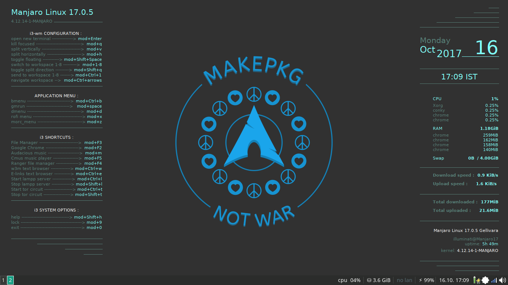

# My_Manjaro_Conky
These are some conky configurations i modified from the original Manjaro-i3 builds 

To get this files running on your Manjaro Linux i3 follow [this method](https://github.com/illuminati-RV/illuminatus_Manjaro_Conky/wiki)

Find the original project by [Oberon2007](https://github.com/oberon2007/conky)

Get Manjaro-i3 edition at [Sourceforge](https://sourceforge.net/projects/manjarolinux-community/files/i3/)

